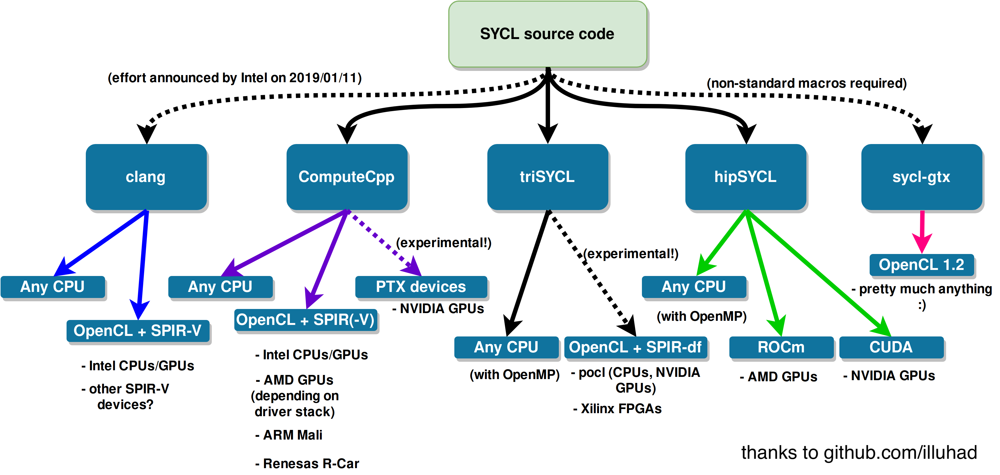

+++
title = "Look ma, no CUDA!"
outputs = ["Reveal"]
[reveal_hugo]
theme = "white"
highlight_theme = "color-brewer"
transition = "slide"
transition_speed = "fast"
+++

# Look ma, no CUDA!
## Programming GPUs with modern C++

Federico Ficarelli @ Meetup C++ 2019-05-09

---

# No more free lunch

* Mostrare evoluzione CPU/Moore's Law
* Mostrare evoluzione potenze di calcolo
* Frequenza -> parallelismo!

---

# CPU vs GPU

* Immagine integrati
* Caratteristiche 
* Dati FLOP/W

---

# Task vs Data parallelism

Latency vs Throughput

---

# The paradygms zoo

Tabella con paradigmi disponibili per C++

---

# CUDA

---

# Hello CUDA!

* Schema di esecuzione

# OpenCL

---

# SYCL

---

# Hello SYCL!

---

### Where to get SYCL

---

# Thank you!

[nazavode.github.io](https://nazavode.github.io)

